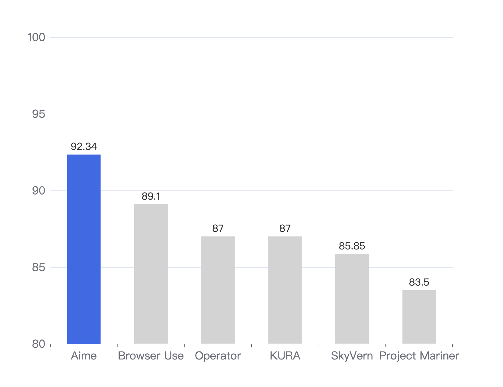
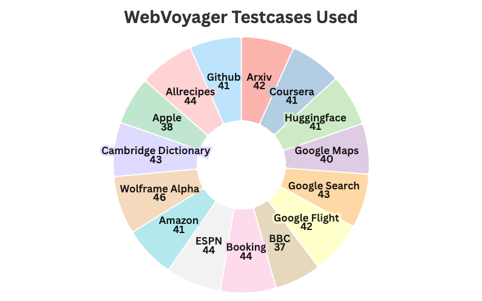
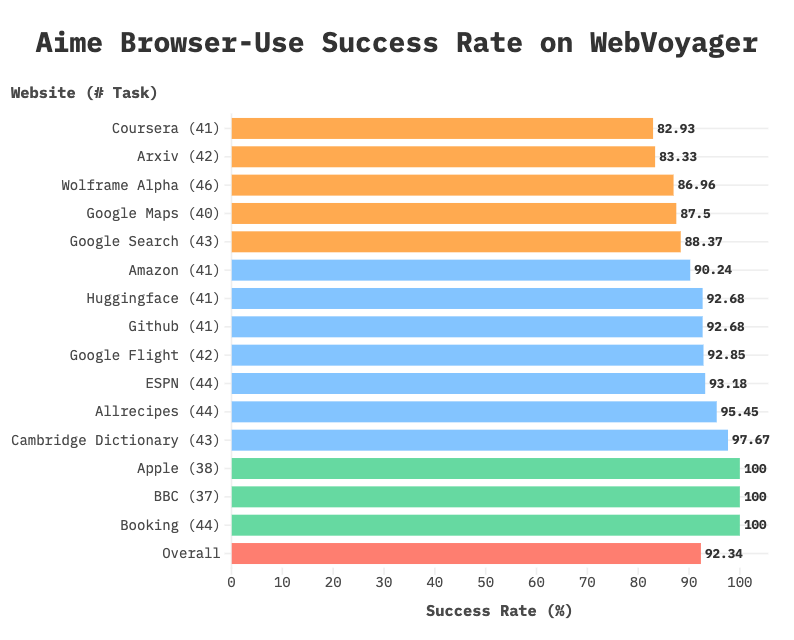

# Aime Browser-USE: New SOTA in WebVoyager

We are excited to announce that **Aime Browser-Use**, as the new State-of-the-Art (SOTA) web agent, has achieved a **92.34% success rate** on the WebVoyager benchmark.  
Aime is an enterprise-level AI Agent framework targeting workplace scenarios.  
Aime Browser-Use, as part of the Aime project, is a web agent that understands and interacts with the browser to automate browser-related tasks in the office.

---

## Agent Architecture

Four key architectural innovations enable Aime Browser-USE's human-like web interaction capabilities:

1. **Semantic DOM Parsing**  
   Uses JavaScript injection to transform webpages into annotated semantic graphs, enabling precise element identification and interactive element manipulation.
2. **Multimodal Fusion**  
   Combines DOM textual analysis with VLM-powered visual processing to interpret complex web environments like canvas components and nested elements.
3. **PlanAct Framework**  
   Decouples task planning (via LLM planner decomposition) from execution (using specialized browser tools), with real-time feedback for adaptive error recovery.
4. **Dynamic Tool Orchestration**  
   Replaces rigid predefined actor models with a modular toolkit, dynamically assembling tools based on task semantics.

---

## Evaluation

### Test Setup: Benchmark Calibration

#### Exclude Unreachable Tasks

To ensure valid and comparable results, we first filtered 16 unachievable tasks from the WebVoyager test suite.  
These tasks failed due to website version updates, content expiration, or authentication requirements.  
This data cleaning follows industry practices (e.g., browser use, KURA AI).

**Example of an Unachievable Task:**
- **Website Version Update**:  
  “Use the browser to visit https://www.bbc.com/news/, find the Market Data section, and identify the data source company.”  
  _This task failed because the BBC News website no longer has a "Market Data" section after its redesign._
- **Content Expiration**:  
  “Use the browser to visit https://huggingface.co/, open space: argilla/notux-chat-ui and interact with it by asking it 'which team trained you'. What is its answer?”  
  _This task failed because the space argilla/notux-chat-ui has been deleted._
- **Authentication Requirement**:  
  “Use the browser: https://huggingface.co/, Use the Huggingface Inference API to generate a short story about a dragon and a wizard.”  
  _This task failed because a Hugging Face API key is required to complete it._

#### Update Date-Sensitive Tasks

For booking websites like Booking.com and Google Flights, content from past dates is not available anymore.  
For those cases, we advance the date by one or two years to bring it to the available range at the time the evaluation is conducted (June 2025).

**After filtering, task distribution across websites is visualized as follows:**  

---

### Evaluation Result

Aime Browser-Use achieved an overall success rate of **92.34%**, with 579 out of 627 tasks completed successfully.  
Website-specific success rates are summarized in the figure below.

Aime Browser-USE demonstrated robust performance across diverse scenarios, with notable patterns by category:

| Website Category      | Characteristics                                                                 | Success Rate Pattern         | Examples                  |
|----------------------|----------------------------------------------------------------------------------|-----------------------------|---------------------------|
| Information-Retrieval| Static content dominance; tasks focused on querying/extracting information        | Top-performing domain (≥95%)| BBC, Apple, Allrecipes    |
| Operation-Centric    | Complex interactions (e.g., form-filling, filtering)                             | Stable at ≥90%              | Google Flight, Amazon, Booking |
| Exploratory          | Unstructured exploration (deeply nested info, ambiguous navigation)               | Relatively lower success    | Google Maps, Wolfram Alpha|

---

## Analysis

### Capabilities of Aime Browser Use

#### Core Strengths

- **Information-Retrieval Proficiency**:  
  High success in static content environments (e.g., Cambridge Dictionary, Apple, BBC) stems from the synergy of DOM parsing for structured text and VLM-powered visual analysis.
- **Browser Interaction Proficiency**:  
  On high-interactivity platforms (e.g., Booking, Google Flights, Amazon), we achieve success rates of ≥90% with a comprehensive tool set and robust architecture.

#### Current Bottlenecks

- **Exploratory Challenges**:  
  For tasks requiring autonomous navigation to locate deeply nested information, Aime Browser-Use is currently often confused by multi-layered webpages.
- **Dynamic Content Parsing**:  
  Aime struggles with dynamic canvas rendering, lazy-loaded elements, and other complex demonstrations.

---

### Limitations of WebVoyager Benchmark

As an industry-standard benchmark, WebVoyager exhibits critical gaps in several aspects:

- **Temporal Relevance**:  
  The rapid evolution of webpages and time-bound task data renders many test scenarios obsolete.
- **Task Distribution Biases**:  
  Over 85% of tasks focus on read-heavy scenarios, while write-heavy scenarios account for <15%.
- **Limited Task Difficulty**:  
  Predominantly short, isolated tasks lack multi-step, cross-page orchestration.
- **Repetitive Task Patterns**:  
  Most tasks are repetitive, single-action workflows, which do not fully represent complex interaction scenarios.

> While emerging evaluation frameworks address these limitations, WebVoyager remains the de facto standard.  
> We call for the community to prioritize the integration of advanced evaluation methodologies to drive the capabilities of browser use agents toward a broader horizon.
